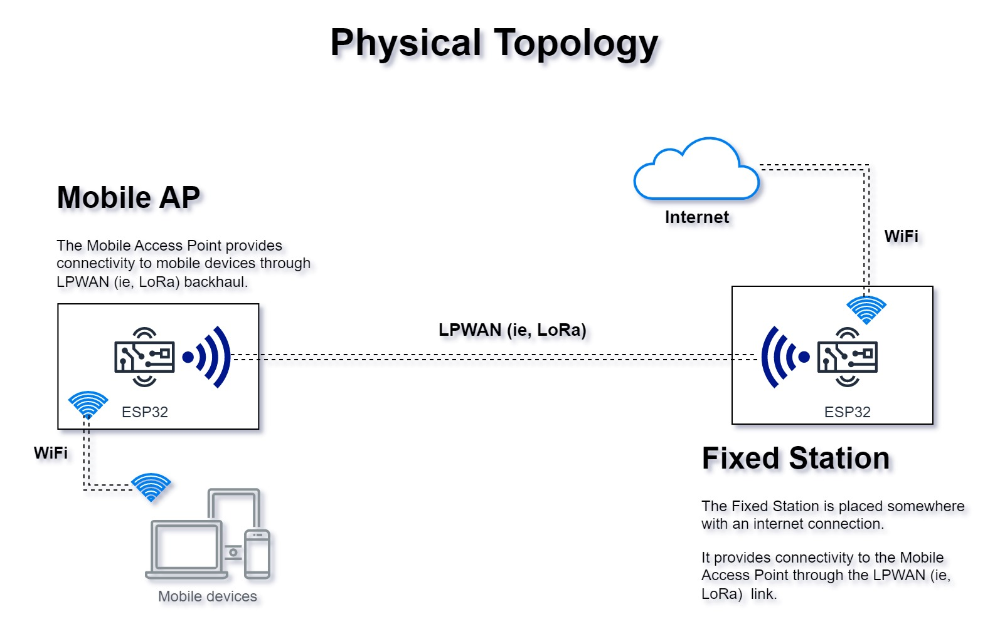
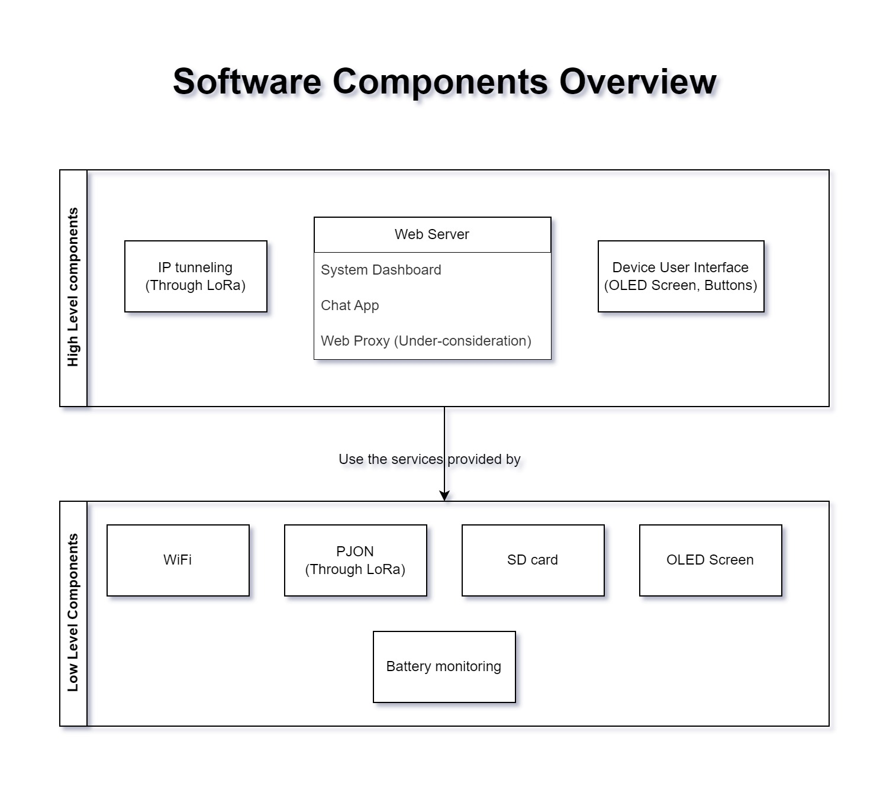

# LongiFi

### Project description

The idea is to design a Personal Wide Area Network (PWAN) using two ESP32 devices with embedded LoRa technology. This solution aims to provide internet connectivity over long distances, spanning kilometers. It can be used in scenarios where internet connectivity is limited, such as when traveling abroad or visiting remote areas. However, it is important to note that the speed of this network will be relatively low, measured in Kilobits per second (Kbps).

The hardware components of this project include two ESP32 devices. One of the ESP32 devices acts as a Fixed Station connected to a fixed Wi-Fi access point, which can be a home network, hotel network, or a friend's hotspot. The second ESP32 device functions as a Mobile AP to which mobile phones can connect. The data transmission process involves transferring data from the phone to the Mobile AP, which then utilizes LoRa technology to send the data to the Fixed Station. Upon receiving the data, the Fixed Station sends it to the Internet via Wi-Fi.

On the software side, data transmission between the phone and Mobile AP occurs through Wi-Fi. Once the data is received, it is encapsulated, and a header is added to each segment using the PJON protocol. The encapsulated data is then transmitted via LoRa. When the data reaches the Fixed Station, the packets are sent to the Internet using Wi-Fi.

The importance of this idea lies in its ability to establish a wireless network infrastructure over long distances. Thus, enabling internet connectivity in areas where traditional Wi-Fi and cellular data is unavailable. It can be particularly valuable in remote locations or areas with limited infrastructure. The solution, utilizing ESP32 devices and LoRa technology, offers a cost-effective and scalable approach.

### Diagrams

